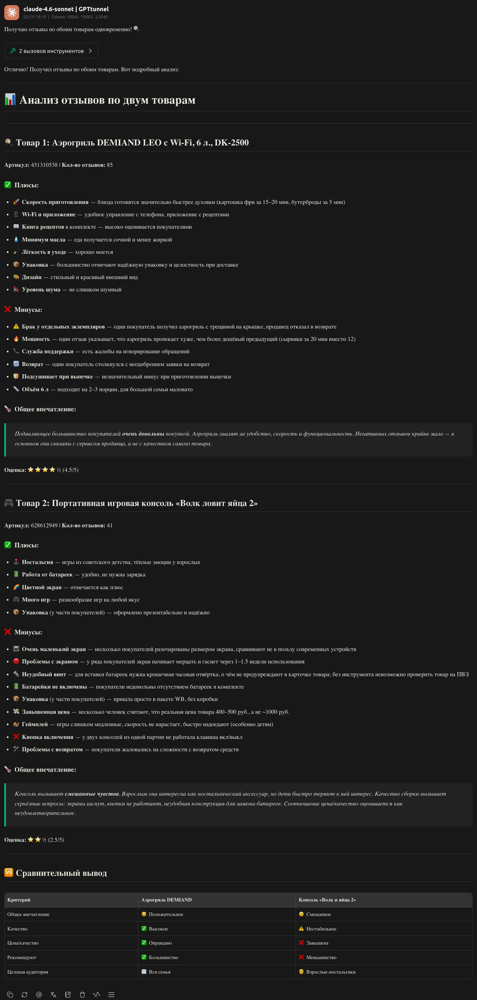

# WB Smart Review — MCP Server

> MCP server for retrieving Wildberries product reviews, designed for seamless integration with LLM clients like Cherry Studio, Claude Desktop, and Cursor.

<details>
<summary>👀 Пример использования</summary>



</details>

## Features

- ✨ **Easy Integration**: Works out-of-the-box with standard MCP clients.
- 🚀 **Smart Scraping**: Automatically determines the correct "basket" host for any Wildberries SKU.
- 🔧 **LLM Ready**: Formats reviews as JSON for easy analysis by Large Language Models.
- 📊 **Rich Data**: Provides product name, total review count, and raw review texts (up to 500).

## Quick Start

```bash
# Install dependencies
pip install -r requirements.txt

# Start the MCP server in development mode
mcp dev server.py
```

## Installation

### Prerequisites

- Python 3.10 or higher
- `pip` package manager

### Development Setup

1. **Clone the repository**
   ```bash
   git clone https://github.com/Start-Python-w/wb_smart_remaster.git
   cd wb_smart_remaster
   ```

2. **Create a virtual environment**
   ```bash
   python3 -m venv .venv
   source .venv/bin/activate  # On Windows use: .venv\Scripts\activate
   ```

3. **Install dependencies**
   ```bash
   pip install -r requirements.txt
   ```

## Docker

You can also run the MCP server using Docker. This is useful for keeping your environment clean or for deployment.

### Build and Run

1. **Build the image**
   ```bash
   docker build -t wb-mcp-server .
   ```

2. **Run the container**
   ```bash
   docker run -i --rm wb-mcp-server
   ```
   *The `-i` flag is crucial for MCP to work over Stdio.*

### Docker Composition

You can use `docker-compose` to run the server:
```bash
docker-compose up
```

## Configuration

Configure your LLM client to use the MCP server.

### Client Config (Docker)

If you prefer using the Docker container directly in your client:

- **Command**: `docker`
- **Args**: `run`, `-i`, `--rm`, `wb-mcp-server`

### Cherry Studio 🍒

1. Go to **Settings** → **MCP Servers**.
2. Click **Add**.
3. Configure as **Stdio**:
   - **Name**: `WB Analyzer`
   - **Command**: `/absolute/path/to/project/.venv/bin/python`
   - **Args**: `/absolute/path/to/project/server.py`
4. Click **Save**.

### Claude Desktop

Add the following to your `claude_desktop_config.json`:

```json
{
  "mcpServers": {
    "wb-analyzer": {
      "command": "/absolute/path/to/project/.venv/bin/mcp",
      "args": ["run", "server.py"]
    }
  }
}
```

> **Note**: Replace `/absolute/path/to/project/` with the actual path to your project directory.

## Usage

Once connected, you can ask your LLM to analyze products directly in the chat.

**Example Prompts:**
- "Analyze the reviews for this product: [SKU or URL]"
- "What are the pros and cons of item 12345678?"
- "Summarize the customer feedback for this link: https://www.wildberries.ru/catalog/..."

The client will automatically call the `get_wb_reviews` tool and use the returned data to answer your request.

## Tools

| Tool | Description |
|------|-------------|
| `get_wb_reviews` | Retrieves product reviews from Wildberries by URL or SKU. Returns JSON with reviews and product info. |

## License

[MIT](LICENSE)
